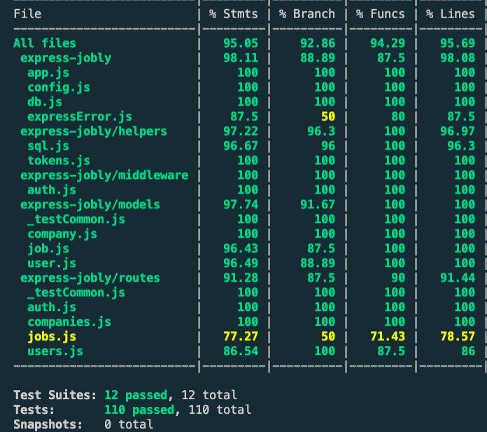

# Jobly Backend

This is the Express backend for Jobly, version 2.

```js
npm start
```
or
```js
nodemon start
```
    
Run detailed integration tests for routes:
```
jest --coverage
```
Run a regular integration tests for routes:
```
jest -i
```


